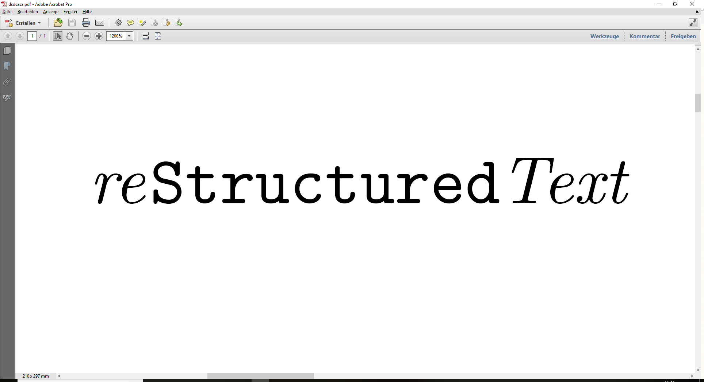

Realizzazione di un sito web
============================

|image01|

PRIMO step: conversione da *docx* a *txt*
-----------------------------------------

Utilizzare lo script bash per la conversione massive dei file.
E' necessario aver installato **pandoc**.

SECONDO step: inserimento markup reStructuredText
-------------------------------------------------

Per convertire un documento ci si può aiutare usando il semplice editor online:
`RestructuredText on line <http://rst.ninjs.org/>'_

o, in alternativa, si può utilizzare un qualunque editor di testo aggiungendo i simboli grafici necessari ad individuare i titoli e i paragrafi.

Rinominare l'estensione del file da .txt a .rst, aiuterà a capire quali file sono stati modificati.

TERZO step: creazione indici
----------------------------

Ordinare i documenti in sottocartelle in base ai temi delle schede e creare una pagina di indice.

Le sottocartelle conterranno i file ed eventuali immagini. Queste verranno salvate in una sottocartella /images ed avranno lo stesso nome file del file .rst a cui si riferiscono ed eventualmente, se sono presenti più di una immagine, un numero progressivo: *nomefile01.jpg*.

