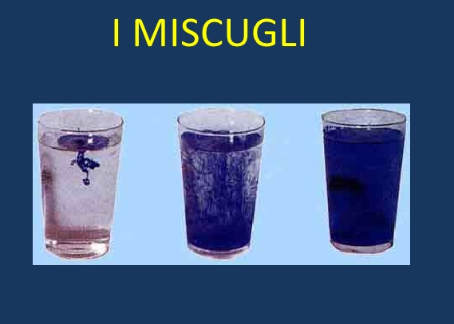

SEPARA I COMPONENTI DI UN MISCUGLIO
===================================

.. note::
   **TEMPO**: 5 e 10 minuti rispettivamente

PRIMA PARTE
-----------

CHE COSA SERVE
--------------

- Limatura di ferro
- Polvere di zolfo
- Un cucchiaino
- Una calamita

COME SI PROCEDE
---------------

Mescola un cucchiaino di limatura di ferro con uno di polvere di zolfo. Ottieni così un miscuglio eterogeneo di ferro e zolfo. In questo caso è possibile separare le due sostanze che compongono il miscuglio utilizzando la calamita (separazione fisica)

SECONDA PARTE
-------------

CHE COSA SERVE
--------------

Riso

- Acqua
- Carta da filtro
- Un imbuto
- Una ciotola
- Un bicchiere

COME SI PROCEDE
---------------

Mescola in una ciotola un po’ di riso e l’acqua di un bicchiere. Prendi un disco di carta da filtro e piegalo lungo i due diametri in modo da dividerlo in quarti. Sistema il filtro nell’imbuto in modo da aprire solo il primo quadrante lasciando ripiegati gli altri tre. Appoggia l’imbuto su un bicchiere e filtra il miscuglio.

CHE COSA OSSERVO
----------------

Anche i due componenti del miscuglio si sono separati (separazione per filtrazione).

.. hint:: 
  **COME LO SPIEGO**
  
  Esistono delle tecniche che permettono di separare i componenti di un miscuglio sfruttando le loro proprietà. Il ferro, a differenza dello zolfo, ha la proprietà di essere attratto dalla calamita, così come il riso ha dimensioni tali da non passare attraverso la carta da filtro. Queste tecniche sono utilizzabili solo in alcuni casi, e peraltro una separazione completa è quasi sempre impossibile: avrai notato infatti che il riso rimasto nella carta da filtro è comunque umido, come una piccola parte dello zolfo rimane comunque unita alla limatura di ferro.
