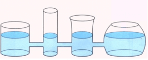

VASI COMUNICANTI
================

.. note::
   **TEMPO**: 10 minuti

CHE COSA SERVE
--------------

- Vasi comunicanti
- Acqua
- Un colorante (inchiostro o permanganato di potassio)
- Un becher
- Una bacchetta di vetro

   
COME SI PROCEDE
---------------

Riempi il becher di acqua, aggiungi alcune gocce di colorante e mescola con la bacchetta. Hai in tal modo preparato una soluzione, in cui l’acqua è il solvente, perché è presente in maggiore quantità e il colorante è il soluto, perché presente in quantità minore. Versa ora il contenuto del becher in uno dei vasi comunicanti.

CHE COSA OSSERVO
----------------

Il liquido in ciascun vaso ha raggiunto lo stesso livello

COME LO SPIEGO
--------------

.. hint::  
  Quando si mettono in comunicazione due o più recipienti pieni di liquido, esso per il principio dei vasi comunicanti si dispone allo stesso livello indipendentemente dalla forma e dimensioni dei recipienti. Ciò dipende dal fatto che la pressione atmosferica è la stessa sulla superficie libera di tutti i vasi.
