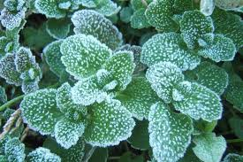

SUBLIMAZIONE E BRINAMENTO
=========================

.. note::
   **TEMPO**: 10 minuti

CHE COSA SERVE
--------------

- Alcuni cristalli di iodio
- Una provetta
- Un batuffolo di cotone
- Una lente d’ingrandimento
- Un fornellino

COME SI PROCEDE
--------------

Metti in una provetta i cristalli di iodio e tappa la provetta con un batuffolo di cotone. Scalda poi la provetta e osserva attentamente ciò che accade aiutandoti anche con una lente d’ingrandimento.

CHE COSA OSSERVO
----------------

Si sviluppano dei vapori colorati e si formano cristalli.

.. hint::
  **Come lo spiego**
  
  I cristalli di iodio passano direttamente dallo stato solido allo stato gassoso senza passare dallo stato liquido. Questo fenomeno si chiama SUBLIMAZIONE. Se però osserviamo bene le pareti della provetta noterai dei nuovi cristalli di piccolissime dimensioni: il gas che si era formato viene a contatto con le pareti fredde della provetta e ritorna direttamente allo stato solido, senza passare dallo stato liquido. Questo fenomeno si chiama BRINAMENTO.
