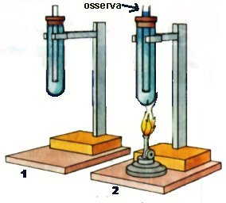

DILATAZIONE TERMICA NEI LIQUIDI
===============================

.. note::
   **TEMPO**: 30 minuti
   
CHE COSA SERVE
--------------

- Due provette o due bottigliette tipo bitter;
- Due tappi forati, due tubicini capillari;
- Acqua;
- Alcol denaturato;
- Un becher;
- Una piastra elettrica

COME SI PROCEDE
---------------

Poni sulla piastra il becher contenente acqua fino a circa metà e scaldalo; prendi poi le provette e riempile rispettivamente con una stessa quantità di acqua e alcol. Chiudile con il tappo dopo aver inserito il tubicini capillare e immergile a bagnomaria nel becher.

CHE COSA OSSERVO
----------------

Inizialmente i livelli di acqua e alcol nei tubicini sono uguali, ma, a mano a mano che i due liquidi si riscaldano, l’alcol aumenta il suo volume in misura maggiore e più velocemente rispetto all’acqua.

.. hint::
  **Come lo spiego**
  
  L’aumento di temperatura provoca il fenomeno della dilatazione termica in entrambi i liquidi. Le molecole dell’alcol però tendono ad allontanarsi tra loro in misura maggiore rispetto a quelle dell’acqua. Per questo motivo l’effetto è molto più evidente nella provetta contenente l’alcol.

