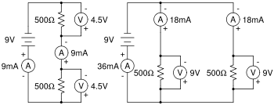

COSTRUIAMO UN CIRCUITO IN SERIE
=================================
CHE COSA SERVE
----------------
Una batteria da 9 volt, carta alluminio, tre led uguali, un pannello di cartone rigido 25 per 30 centimetri, nastro adesivo, forbici, colla, pennellino.

COME SI PROCEDE
-----------------
Taglia tre strisce orizzontali di carta alluminio larghe un paio di centimetri. Spennella un po' di colla sul cartone e taglia opportunamente e incolla sol cartone le strisce di alluminio in modo da realizzare un circuito come in figura interrompendo il circuito di qualche millimetro nelle tre sezioni dove dovranno essere collegati i led. Collega infine i tre led al circuito incollandoli con del nastro adesivo in modo da ripristinare il circuito come in figura:

Collega infine gli estremi liberi del circuito ai poli della batteria da 9V rispettando le polarità(ricorda che il positivo del led è quello con la gambetta più lunga e il negativo quello con la gambetta più corta e che i led conducono la corrente in un solo verso.

CHE COSA OSSERVO
-----------------
Una volta collegati i poli della batteria, i tre led si accendono contemporaneamente; inoltre se interrompiamo il circuito in un punto qualsiasi tutti i led si spengono.

COME LO SPIEGO
----------------

.. hint::
La tensione di 9V è sufficiente per accendere i tre led, inoltre nel circuito in serie la corrente che attraversa i led è sempre la stessa per cui interrompendo il circuito in un punto qualsiasi essa non può più circolare e pertanto le luci si spengono.

.. note::
**TEMPO**: 1 ora
