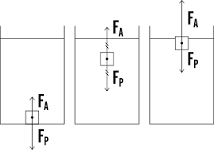

CALCOLIAMO LA SPINTA DI ARCHIMEDE
=================================

.. note::
   **TEMPO**: 20 minuti

CHE COSA SERVE
--------------

Servono:
- un dinamometro
- un sasso legato con una cordicella
- un cilindro graduato
- acqua

COME SI PROCEDE
---------------

Appendiamo il sasso al dinamometro e pesiamolo fuori dall’acqua e sia ad esempio:

- P₁= 270 g PESO DEL SASSO FUORI DALL’ACQUA

Riempiamo il cilindro graduato con una quantità nota d’acqua e immergiamo in esso il sasso sempre appeso al dinamometro, registriamo il peso del sasso e il volume di acqua spostata che è uguale al volume del sasso e sia ad esempio:

- P₂= 170 g PESO DEL SASSO IN ACQUA

- V= 100 cm³ VOLUME D’ACQUA SPOSTATA

Osserviamo che il sasso in acqua pesa esattamente 100 g in meno infatti:

- P₁-P₂ = 270-170= 100 g

CHE COSA OSSERVO
----------------

L’intensità della spinta idrostatica vale quindi 100 g-peso, il sasso tende ad affondare e la spinta è proprio uguale al peso del volume d’acqua spostato

COME LO SPIEGO
--------------

.. hint::
  Poiché 1ml= 1cm³ di acqua pesa esattamente 1g ne consegue che spinta e peso di acqua spostato sono uguali, inoltre il sasso affonda perché la spinta è minore del suo peso.

