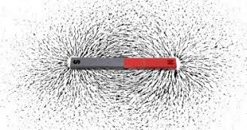

CAMPO MAGNETICO E LIMATURA DI FERRO
====================================
CHE COSA SERVE
----------------
Un magnete ad U(o di altra forma), limatura di ferro, un piatto di plastica trasparente(o un foglio di carta rigida)

COME SI PROCEDE
----------------
Appoggiamo il magnete su un tavolo e su di esso il piatto di plastica trasparente. Spargiamo sul piatto delle piccole quantità di limatura di ferro in modo tale da ricoprire con una quantità sufficiente la parte intorno alla calamita.

CHE COSA OSSERVO
------------------
La limatura si dispone intorno alla calamita addensandosi di più ai poli e intorno ad essa formando delle particolari linee; parallele all’interno della U, ed ad arco esternamente.

COME LO SPIEGO
----------------
.. hint::
Il magnete genera un campo di forze nello spazio circostante la cui intensità dipende dalla distanza dalla calamita è maggiore vicino ad essa e diminuisce allontanandosene. Pertanto la limatura forma delle particolari linee attorno al magnete, dette linee di forza o di campo, che risultano parallele all’interno della U e ad arco da un polo all’altro e all’esterno del magnete.

.. note::
**TEMPO**: 15 minuti
