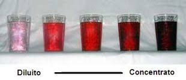

  CONCENTRAZIONE DI UNA SOLUZIONE
===================================
  CHE COSA SERVE
-------------------
  Due provette uguali, un porta provette, del colorante, un contagocce, acqua di rubinetto.

  COME SI PROCEDE
--------------------
  Riempi le due provette con la stessa quantità di acqua e mettile nel porta provette. Fai cadere nella prima provetta cinque gocce di colorante e nella seconda il doppio. Dopo qualche minuto aggiungi nella prima provetta altre cinque gocce di colorante, infine, dopo qualche minuto, aggiungi altra acqua nella seconda provetta.
  

  CHE COSA OSSERVO
---------------------
  Nel primo caso notiamo che il contenuto della seconda provetta ha un colore più intenso della prima; nel secondo caso i colori sono circa uguali; nel terzo caso il colore più intenso diventa quello della prima provetta.

  COME LO SPIEGO
------------------

.. hint::
  E’ facile capire che sciogliendo più colorante, soluto, nell’acqua , solvente, delle provette il colore della soluzione si accentua, mentre il colore della soluzione diventa meno intenso se aumentiamo la quantità di acqua. Questo fatto ci suggerisce il concetto di “concentrazione” di soluto nel solvente come rapporto( in grammi in volume in percentuale) tra la quantità di soluto e di solvente.

.. note::
  **TEMPO**: 10 minuti
