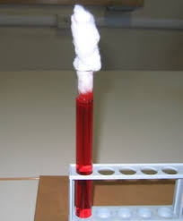

VASI COMUNICANTI CAPILLARI COTONE IDROFILO
=============================================

.. note::
**TEMPO**: 10 minuti

CHE COSA SERVE
----------------

-Vasi comunicanti con tubicini capillari
-cotone idrofilo
-liquido colorato

   
COME SI PROCEDE
-----------------
Versa del liquido colorato in uno dei tubicini dei vasi capillari e quando i livelli si sono stabilizzati, appoggia un pezzetto di cotone sul tubo di diametro maggiore.

CHE COSA OSSERVO
-------------------
Nei tubicini capillari il liquido colorato raggiunge un livello rispetto ai tubicini di sezione maggiore; inoltre il cotone si colora via via anche per la parte che emerge dal tubicino.

COME LO SPIEGO
-----------------

.. hint::  
Nei tubicini capillari il livello del liquido è maggiore proprio a causa del fenomeno della capillarità cioè a causa delle forze di adesione parete-liquido che risultano maggiori delle forze di coesione tra le molecole di liquido. Le fibre di cui è costituito il cotone sono molto sottili e si possono assimilare a dei tubicini capillari: il liquido colorato risale attraverso tali fibre e colora il cotone esterno.

