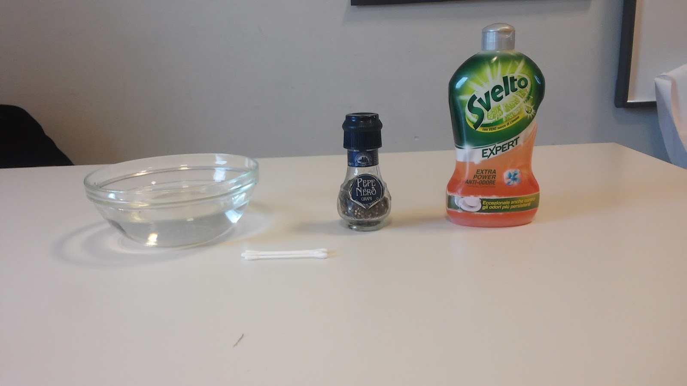

TENSIONE SUPERFICIALE AL PEPE NERO
====================================

.. note::
**TEMPO**: 10 minuti

CHE COSA SERVE
----------------
-Una bacinella del pepe macinato
-acqua di rubinetto
-detersivo per piatti

COME SI PROCEDE
-----------------
Riempi a metà la bacinella con acqua e spargi su di essa il pepe fino a formarne uno straterello.Immergi delicatamente un dito nella vaschetta in più punti come se dovessi fare dei buchi, poi metti un po’ di detersivo nel dito e immergilo di nuovo in acqua.

CHE COSA OSSERVO
------------------
Il pepe resta in superficie, immergendo il dito nell’acqua ovviamente esso si sposta, quando tolgo il dito resta una zona povera di pepe che tuttavia dopo poco tempo viene di nuovo ricoperta dal pepe stesso. Quando immergo il dito sporco di detersivo il pepe si sposta velocemente verso il bordo del recipiente lasciando scoperta la zona centrale che non viene più ricoperta dal pepe.

COME LO SPIEGO
----------------

.. hint::
Le molecole della superficie dell’acqua sono sottoposte ad una forza, detta tensione superficiale, che si comporta come una membrana elastica: essa è abbastanza resistente da sostenere le particelle di pepe e riesce a riavvicinare le molecole di acqua dopo che abbiamo tolto il dito . Il detersivo è una sostanza che riesce a rompere la tensione superficiale, infatti è un tensioattivo, facendo allontanare le molecole superficiali tra loro che in tale movimento trascinano verso l’esterno le particelle di pepe.

