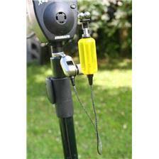

TENSIONE GRAFFA
=================

.. note::
   **TEMPO**: 10 minuti
   
CHE COSA SERVE
---------------
-Un bicchiere
-una graffetta
-detersivo per piatti
-una pinzetta
-acqua di rubinetto

   
COME SI PROCEDE
------------------
Riempi completamente il bicchiere d’acqua e afferrando con le pinzette la graffetta poggiala sulla superficie sressa dell’acqua. Se la graffetta affonda ripescala e ripeti il procedimento finchè essa non galleggerà nell’acqua. Immergi poi il dito nel detersivo e toca la superficie dell’acqua nel bicchiere.

CHE COSA OSSERVO
-------------------
Dopo qualche tentativo vedremo che si riesce a far galleggiare la graffetta anche se il materiale con cui essa è fatta ha densità maggiore di quella dell’acqua.

COME LO SPIEGO
----------------

.. hint:: 
Le molecole superficiali dell’acqua sono sottoposte ad una forza, detta tensione superficiale, che agisce come una membrana elastica ed è in grado di sostenere dei piccoli pesi, come quello della graffetta, che quindi riesce a galleggiare. Toccando la superficie col detersivo tale membrana si rompe perché il detersivo, che è un tensioattivo, ha la capacità di allontanare tra loro le molecole di acqua spezzando così la forza che le tiene unite.

